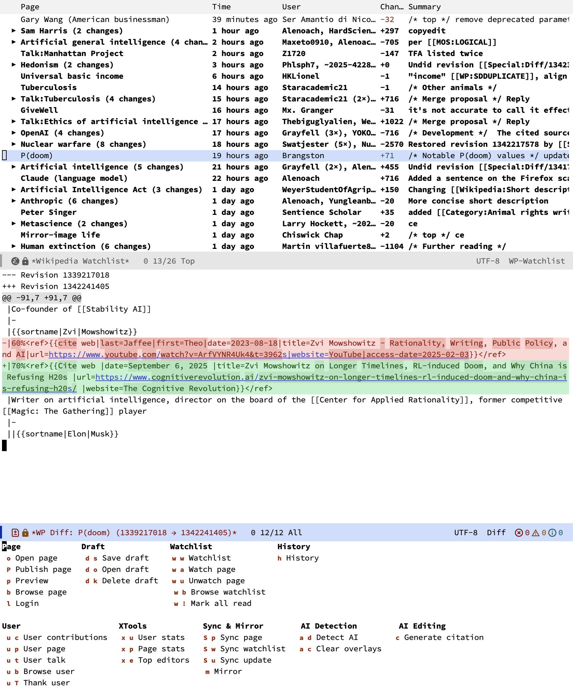

# `wikipedia`: Emacs interface for Wikipedia editing

## Overview

`wikipedia` provides a comprehensive Emacs interface for editing, reviewing, and managing Wikipedia content. It builds on top of `mediawiki.el`, which handles the low-level MediaWiki API communication, and adds higher-level workflows on top: page editing with live HTML preview, a grouped and expandable watchlist with unread tracking, full revision history browsing with arbitrary diffs, user contribution inspection, XTools statistics integration, and a local SQLite mirror for offline access.



The package is aimed at Wikipedia editors who want to work from within Emacs. You can open any page for editing, preview rendered HTML without leaving Emacs, save local drafts that persist across sessions, and publish changes back to the wiki. The watchlist buffer groups recent changes by page, prefetches diffs in the background, and supports a "diff follow" mode that automatically displays diffs as you navigate entries.

Beyond editing, `wikipedia` offers tools for reviewing other editors' work: browse user contributions, send thank notifications, and look up detailed editing statistics via the XTools API. For power users, a synchronization system can mirror your entire watchlist into a local SQLite database for offline browsing and faster access.

With the optional `gptel` package, AI-powered features become available: generate Wikipedia citation templates from URLs or descriptions, produce edit summaries from diffs following Wikipedia's conventions, and score watchlist changes by review priority so you can focus on the edits that matter most. Models and backends can be configured per-command.

All commands are accessible through a unified transient menu via `wikipedia-transient`.

## Installation

`wikipedia` requires Emacs 29.1 or later.

**Dependencies:**

- [`mediawiki`](https://github.com/hexmode/mediawiki-el) (>= 2.4.9) -- required for MediaWiki API communication
- [`gptel`](https://github.com/karthink/gptel) -- optional, enables AI-powered citation generation, edit summaries, and watchlist review scoring

### package-vc (built-in since Emacs 30)

```emacs-lisp
(use-package wikipedia
  :vc (:url "https://github.com/benthamite/wikipedia"))
```

### Elpaca

```emacs-lisp
(use-package wikipedia
  :ensure (:host github :repo "benthamite/wikipedia"))
```

### straight.el

```emacs-lisp
(use-package wikipedia
  :straight (:host github :repo "benthamite/wikipedia"))
```

## Quick start

```emacs-lisp
(use-package wikipedia
  :ensure (:host github :repo "benthamite/wikipedia")
  :bind ("C-c w" . wikipedia-transient))
```

After installing, configure your wiki site credentials via `mediawiki-site-alist` (see the `mediawiki.el` documentation), then run `M-x wikipedia-login` to establish a session. From there:

- `M-x wikipedia-open` to open a page for editing
- `M-x wikipedia-watchlist` to browse your watchlist
- `M-x wikipedia-transient` to access all commands from a single menu

## Documentation

For a comprehensive description of all user options, commands, and functions, see the [manual](https://stafforini.com/notes/wikipedia/).
